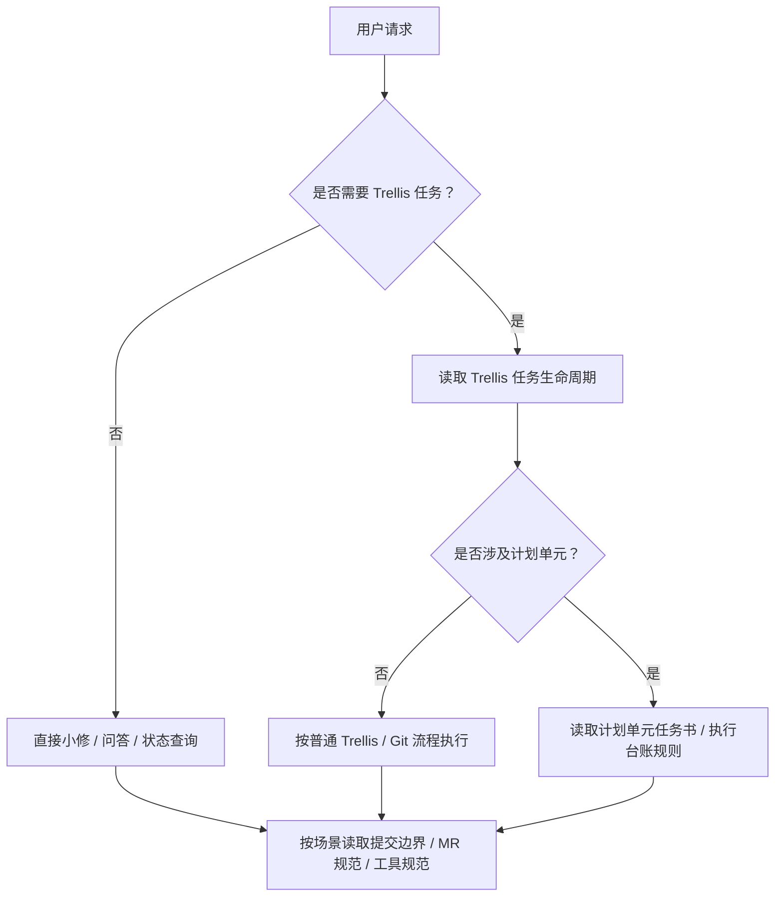

# 项目级规范

> 适用于 Trellis 任务、Git 协作、计划单元文档、工具边界和跨角色协作的项目级约定。

---

## 概览

本目录存放仓库级治理规范。在创建任务、提交、推送、创建 MR / PR、归档 Trellis 任务、同步计划单元进度或调整工具运行范围前，应先读取这些文件。

文档写作、任务记录和 `.trellis/spec/**` 规范沉淀建议以团队主要协作语言为主。技术专有名词、命令、代码标识、环境变量、文件路径、commit 类型、MR / PR、GitLab / GitHub、Docker、Trellis、work commit、archive commit、journal commit、docs progress commit 等可保留英文。

---

## 执行导航图

本图只用于判断应该继续读取哪类规范；完整任务执行顺序以 [Trellis 任务生命周期](./trellis-task-lifecycle.md) 为准。

---

## 规范索引

| 规范 | 说明 |
|------|------|
| [Git 工作流总入口](./git-workflow-guidelines.md) | Git / Trellis 工作流总入口、阅读顺序和最短检查清单 |
| [提交边界](./commit-boundaries.md) | 提交信息格式、文件边界、Trellis 任务文件处理和提交前检查 |
| [MR / PR 规范](./mr-guidelines.md) | 分支命名、MR / PR 标题与描述、推送和合并后清理 |
| [Trellis 任务生命周期](./trellis-task-lifecycle.md) | inline 模式、任务创建边界、finish-work 顺序和计划单元同步时机 |
| [计划单元任务书规范](./planning-unit-planning-guidelines.md) | 定义计划单元稳定规划契约 |
| [计划单元执行台账规范](./planning-unit-ledger-guidelines.md) | 定义计划单元滚动事实记录 |
| [工具规范](./tooling-guidelines.md) | 仓库级工具范围、环境隔离、官方 CLI 和质量命令边界 |
| [工作流反例](./workflow-anti-patterns.md) | 常见流程偏差、风险解释和纠偏做法 |

---

## 开发前检查清单

- [ ] 在创建分支、提交、推送、更新 MR / PR 或任务状态前，先读 [Git 工作流总入口](./git-workflow-guidelines.md)。
- [ ] 如果即将 `git add` 或起草 work commit，继续读 [提交边界](./commit-boundaries.md)。
- [ ] 如果即将推分支、创建 / 更新 MR / PR，或在合并后清理分支，继续读 [MR / PR 规范](./mr-guidelines.md)。
- [ ] 如果当前工作使用 Trellis 任务或涉及计划单元任务书 / 执行台账，继续读 [Trellis 任务生命周期](./trellis-task-lifecycle.md)。
- [ ] 如果不确定某条规则为什么存在，或需要具体反例，读 [工作流反例](./workflow-anti-patterns.md)。
- [ ] 在修改根级工具配置、质量命令范围、运行环境或构建上下文前，读 [工具规范](./tooling-guidelines.md)。
- [ ] 当项目级规范和 package / layer 级规范冲突时，以项目级规范为准。

---

## 语言约定

模板本身不强制目标项目使用某一种自然语言。目标项目初始化后，应在本文件中明确团队主要协作语言，并保持任务记录、规则说明、验收标准和协作文档的语言风格一致。
