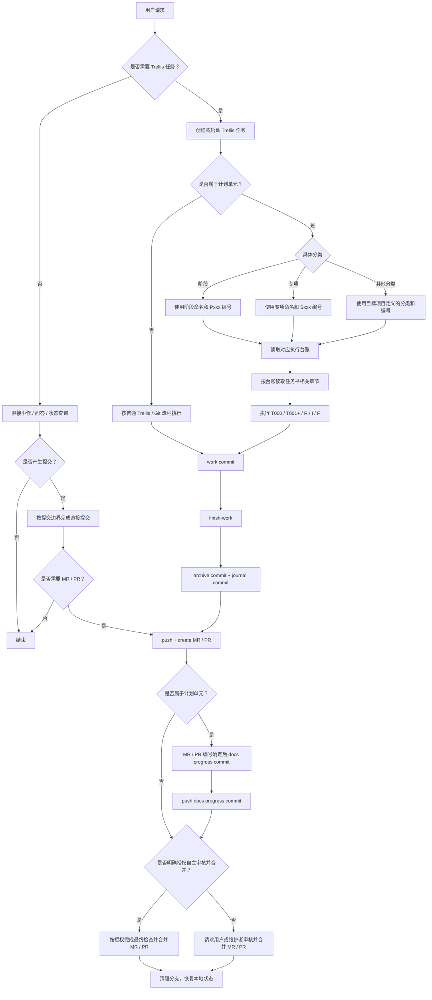

# Trellis 任务生命周期

> Trellis 的 inline 模式、任务创建边界、finish-work 顺序和计划单元同步规则。

---

## inline 执行模式

在支持 inline 执行的智能体环境中，可以优先使用 Trellis `inline` 模式：主会话直接读取规范、实现变更、运行检查和完成提交，不默认派发实现或检查子代理。

执行要求：

- 当上下文中出现 inline 模式标记，或 workflow breadcrumb 标明 inline 执行时，以 inline 指引为准；
- 主会话在开始实现前读取当前任务 artifact 和相关 `.trellis/spec/**`；
- 主会话完成实现后运行项目要求的检查；
- 不默认使用实现 / 检查子代理；
- 如例外派发了子代理，主会话仍必须独立核验结果。

### inline 执行模式的任务产物读取顺序

进入 `in_progress` 后，主会话应先读当前任务的 `prd.md`、`design.md`（若存在）和 `implement.md`（若存在），再按修改范围读取 `.trellis/spec/**`。不要只依赖会话记忆或计划单元摘要开始改文件。

如果任务是文档审查、spec 沉淀或计划单元类工作，`implement.md` 应把 work commit、finish-work、MR / PR 和 docs progress commit 的顺序写成可核对清单。

---

## Trellis 任务创建边界

Trellis 任务用于承载那些需要规划、执行留痕、验收判断、归档沉淀和 journal 追踪的工作，而不是所有改动都必须套上一层任务。主会话在开始前应先判断两件事：这项工作是否足够复杂，以及后续是否需要被清晰追溯。

默认不创建 Trellis 任务的情况：

- 用户已经明确要求“不建任务”“直接改”“小修一下”“先别走流程”等；
- 单个规则、说明或小段文档沉淀，例如把已讨论清楚的约定补到 `.trellis/spec/`；
- 小范围文案、链接、错别字、格式或状态同步修正；
- 纯问答、查状态、解释流程或仅读取已有文档；
- 明确允许在当前分支直接完成的轻量修补，且不需要额外 PRD、研究记录或归档说明。

应创建 Trellis 任务的情况：

- 用户明确要求按 Trellis 流程推进，或要求先建任务再开始；
- 已经被拆分进计划单元、里程碑或任务清单的工作；
- 新功能、缺陷修复、重构、跨模块变更或涉及业务代码的实现；
- 需要 PRD、研究记录、验收标准、归档材料或后续审计留痕的工作；
- 预计会跨多个提交、多个会话，或需要在主会话与子代理之间持续同步上下文的工作。

判断原则：

- 只要主要目标是“改产物”，并且范围小、上下文简单、无需追踪，就优先直接修改；
- 只要主要目标是“推进一项可独立管理的工作”，并且需要过程留痕，就应先创建 Trellis 任务；
- `.trellis/spec/**` 是否随 work commit 一起提交，取决于它是否属于本次工作的产物；这不自动意味着必须创建 Trellis 任务；
- 不同智能体平台都应遵循同一判断逻辑，不以某个平台是否支持特定命令或 UI 作为创建任务的前提。

---

## 规划产物深度

Trellis 任务开始实现前，应按任务复杂度选择规划产物深度：

| 情况 | 规划产物 |
|------|----------|
| 单点、小范围、需求和验收标准明确，且没有跨文档 / 跨模块引用 | `prd.md` 可以足够 |
| 计划单元内任务、里程碑任务、审查型任务、需要 MR / PR 后同步计划单元台账的任务 | `prd.md` + `design.md` + `implement.md` |
| 需要分多轮提交、需要抽样 / 统计 / 横向对照、或后续任务会引用本任务结论 | `prd.md` + `design.md` + `implement.md` |
| 只是把已确认的小规则补到 `.trellis/spec/**`，且无需任务归档 / journal 追踪 | 通常不创建 Trellis 任务，直接按提交边界处理 |

`prd.md` 只写需求、约束和验收标准；`design.md` 写边界、输入材料、工作模型和风险；`implement.md` 写可执行 checklist、验证命令、提交边界和回滚点。不要把技术执行清单塞进 PRD，也不要把 PRD 写成泛泛复盘。

计划单元内任务即使主要产出是文档或 spec，也通常不是轻量任务：它们需要归档、journal、MR / PR 编号和计划单元进度互相对应，因此应补齐 `design.md` 和 `implement.md` 后再启动。

---

## 计划单元任务书与执行台账

计划单元是项目中用于组织一组可追踪 Trellis 任务的流程单元。常见计划单元类型包括：

- **阶段**：编号前缀可为 `Pxxx`，表示项目主线演进周期；
- **专项**：编号前缀可为 `Sxxx`，表示围绕单一能力域或问题域的小型阶段化推进。

阶段和专项在流程上遵循同一套计划单元规则，差异只在应用范围和编号前缀。计划单元 `T000` 规划任务应把稳定规划与滚动状态拆分为两类文档：

- **任务书**：计划单元规划契约，记录目标、范围 / 非范围、问题分级、无状态任务清单、任务拆分、依赖关系和各任务详细说明。任务书是后续任务执行时应遵循的计划内容，不承载当前状态、下一步和完成台账。
- **执行台账**：计划单元当前任务入口，记录当前状态、下一步任务、完成记录、关键问题处理记录和 docs progress commit 维护清单。
- **启动输入**：上一个计划单元、验收任务或用户授权交给 `T000` 的历史输入材料，只描述来源、启动条件、已知问题和建议方向。`T000` 完成后，启动输入不得继续充当当前状态来源。
- **子产物文档**：例如测试矩阵、验证报告模板、验收总结等，只记录自身产出、适用范围和消费方式，不记录计划单元全局下一步。

命名应体现具体分类和文档职责：实际文档、目录、标题和任务名中不得使用 `计划单元` 作为类型名，应替换为目标项目定义的具体分类名称。

### 计划单元 `T000` 文档产物契约

任务书应包含：

- 文档职责：说明任务书是稳定规划契约，并指向执行台账作为当前状态入口；
- 计划单元定性与目标：说明本计划单元要解决什么、为什么现在做；
- 不包含范围：明确本计划单元不做什么，避免普通子任务扩张边界；
- 问题分级或处置规则：如 P0/P1/P2/P3、豁免条件、后续归属；
- 关键能力 / 交付维度：列出计划单元交付应覆盖的能力域或验证维度；
- 任务清单总览：使用无状态字段，通常只包含任务编号、名称、定位和规划产出；
- 建议执行顺序与依赖关系：记录串行约束和可并行条件；
- 各任务详细说明：记录每个子任务的定位、范围、重点、主要产出和验收依据；
- 计划单元完成后的候选输入：只描述计划单元结束后可能进入的方向，不替代后续计划；
- 信息来源：列出启动输入、验收总结、债务清单、相关 spec 或历史任务。

任务书不得包含：

- 当前状态、下一步任务、完成台账、当前进度；
- MR / PR 编号、分支、主要提交、归档 PRD、journal；
- docs progress commit 检查清单；
- 普通子任务收尾时产生的滚动结论。

执行台账应包含：

- 维护规则：说明本文档是计划单元当前任务入口和滚动维护文档；
- 当前状态与下一步：记录计划单元当前结论、真实下一任务和启动边界；
- 当前任务入口：列出启动下一任务前必须读取的任务书章节、spec 和执行提示；
- 完成台账：记录任务编号与名称、Trellis 归档 PRD、MR / PR、主要 work commit 和分支；
- 关键问题处理记录：记录 P0/P1 或计划单元核心问题的归属、状态和处理证据；
- docs progress 检查清单：说明每次计划单元子任务完成后只维护执行台账中的哪些区域。

执行台账不得改写计划单元范围、任务拆分或验收标准；如果滚动执行中发现规划需要调整，必须先按任务书修订规则处理。

计划单元内编号应遵循 [MR / PR 规范](./mr-guidelines.md) 中的 `T/R/I/F` 类型约定：`T` 用于主线任务，`R` 用于规划修订，`I` 用于问题调查，`F` 用于缺陷修复。完成台账应按实际推进顺序或逻辑依赖顺序排列。

执行要求：

- 启动或继续计划单元内任务时，先读取对应计划单元的执行台账，再按台账指向读取任务书相关章节；
- docs progress commit 默认只更新执行台账，不修改任务书；
- 任务书在 `T000` 之后默认视为稳定规划契约，非明确要求不得在普通子任务收尾时修改；
- 任务书可以保留无状态任务清单，字段应限于任务编号、名称、定位和规划产出；不得包含状态、MR / PR、归档、分支或提交；
- 如需修订任务书，必须有明确授权，不得混入普通 docs progress commit；至少使用独立 commit；
- 执行台账中的完成记录只记录主要 work commit，不记录 archive commit、journal commit 或 docs progress commit。
- README、需求、架构、路线图等外围入口在计划单元推进中只同步计划单元入口指向，不写具体下一任务；下一任务必须从执行台账读取。

---

## 规范沉淀任务

当任务目标是更新 `.trellis/spec/**` 时，先判断它是“单条规则补充”还是“证据型经验沉淀”：

- 单条规则补充：例如一次调试后把明确的防错规则写入 spec，范围小且无需任务审计时，可以直接修改 spec 并提交；
- 证据型经验沉淀：例如计划单元内任务要求回顾 journal、历史任务、提交和 MR / PR 规范执行情况时，应创建 Trellis 任务，写清证据来源、更新范围和验收标准；
- spec 更新必须写成可执行约束、触发场景、检查点或正反例，不写无法落地的复盘散文；
- spec work commit 可以只包含 `.trellis/spec/**`，但仍不得包含活动任务目录；
- 如果该 spec 任务属于计划单元，执行台账仍必须等 MR / PR 编号确定后作为 docs progress commit 追加同步。

---

## 标准流程图

本图是 Trellis 任务与计划单元任务的完整执行顺序事实源；入口导航只负责指向本文件，不重复维护本顺序。



执行要求：

- `计划单元` 只作为规则抽象名；实际命名必须使用目标项目定义的具体分类。
- 计划单元内任务应在 MR / PR 编号确定后，再追加 docs progress commit。
- 未获得明确授权时，智能体不得自行合并 MR / PR。
- MR / PR 合并后，无论由谁合并，都应按 [MR / PR 规范](./mr-guidelines.md) 清理已合并分支并恢复本地开发状态。

---

## 标准命令示例

```bash
# 1. 确认基准分支并更新
git checkout <main-development-branch>
git pull --ff-only

# 2. 创建工作分支
git checkout -b docs/project-git-workflow-spec

# 3. 开发并提交
git add .trellis/spec/project
git commit -m "📝docs(project): 添加项目 Git 工作流规范"

# 4. Trellis 收尾（如当前工作由 Trellis 任务驱动）
<finish-work-command>

# 5. 推送工作分支
git push -u origin docs/project-git-workflow-spec

# 6. 创建 MR / PR
<official-hosting-cli-or-web-ui>
```

---

## 收尾顺序

当变更来自 Trellis 任务时，必须按“标准流程图”完成任务收尾、推送、MR / PR、计划单元台账同步、合并授权判断和分支清理。

执行要求：

- 工作代码提交必须先于 finish-work 完成；
- finish-work 产生的任务归档提交和 journal 提交必须包含在同一个工作分支中；
- 创建 MR / PR 前确认工作分支已经包含 work commit、archive commit 和 journal commit；
- 计划单元内任务应在 MR / PR 编号确定后，再追加 docs progress commit；
- 不要先创建或合并只含工作提交的 MR / PR，再用另一个 MR / PR 补任务归档和 journal。

---

## 计划单元同步前置约束

当任务属于计划单元，或即将修改计划单元任务书 / 执行台账时，必须先重新读取：

- 本专题中的“收尾顺序”；
- 本专题中的“计划单元任务书与执行台账”；
- [工作流反例](./workflow-anti-patterns.md) 中的相关反例；
- [提交边界](./commit-boundaries.md) 中的计划单元任务提交前检查。

不要只依赖 workflow breadcrumb 或 finish-work skill。计划单元台账何时同步、MR / PR 编号何时补充，属于项目 Git 工作流规范。

---

## 计划单元执行台账同步

计划单元内任务完成后，按“标准流程图”在 MR / PR 编号确定后追加 docs progress commit 更新执行台账；没有 MR / PR 编号前不得把执行台账写成完成状态。

同步要求：

- 在执行台账中切换当前状态和下一步任务；
- 在执行台账中补充 MR / PR 编号、工作分支、Trellis 归档 PRD 路径和主要 work commit；
- 如任务处理了计划单元关键问题，在执行台账中记录处理结论；
- “主要提交”只记录主要 work commit；
- 不在“主要提交”中记录 archive、journal 或 docs progress commit；
- 不修改任务书，除非明确要求修订规划契约；
- docs progress commit 在 MR / PR 编号确定后追加，因此执行台账应记录最终完成口径；不要在“当前状态”“关键问题处理记录”等位置写“待 MR / PR 创建”这类中间态。
- 如 MR / PR 已合并后才发现执行台账未同步，应单独补 docs 同步 MR / PR。
